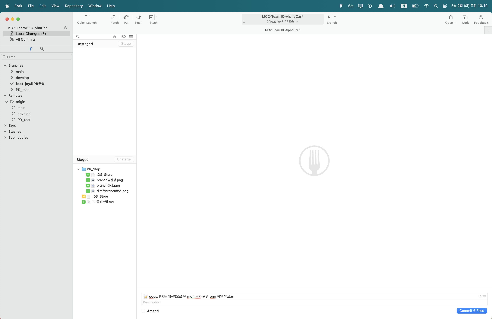

# Step0. git gui 툴 설치하기
- Xcode 내의 git 기능 사용(화면 상단의 Source Control참고), GitKraken, SourceTree, Github Desktop, Fork 등등 git Gui 툴 종류는 매우 다양합니다. 
- 검색을 통해 자신에게 맞는 gui툴을 설치해 사용해 보는 것을 추천드립니다.
- 이번 **MC2 challenge의 숨겨진 목표** 중 하나입니다!😆

# Step1. 새로운 브랜치 생성
아래 예시는 PR 올려보는 것을 연습하는 것이기 때문에 PR_test 브랜치를 기준으로 작성되었습니다.
### 1. PR_test 브랜치에서 New branch 를 생성합니다.

### 2. New branch 명 입력
작성하고자 하는 코드(기능)을 `feat-OO` 으로 지정하여 branch를 생성합니다.

- 예시에서는 **feat-joy의PR연습** 으로 브랜치를 생성했는데 각자 feat-OO의PR연습으로 브랜치 생성해서 PR 연습해 보는 것을 추천합니다.

# Step2. 작업하기
- md파일 하나 만들어 보는 것도 좋을 것 같아용.

# Step3. Commit, Push하기
commit, push가 뭔지 모르시는 분은 https://backlog.com/git-tutorial/kr/ 참조하시길 바랍니다.

# Step4. Pull Request 
### 1. PR 버튼 누르기

### 2. PR template에 따라 작성하기

# Step5. Review 받기
- 최소 2명 이상의 approve를 받아야 develop에 머지할 수 있습니다.
- 팀원 중 누군가 PR를 올렸다면 카톡에 공유하고, 나머지 팀원들은(리뷰어)는 최대한 12시간 안에는 꼭 확인해 주세요!

# Step6. Merge하기

# Step7. Merge된 브랜치는 삭제하기