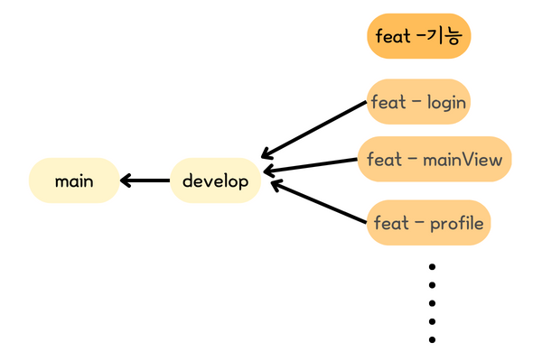

# 소개
Apple Developer Academy 🌓 알파카 팀🦙의 레포지토리입니다.

# 규칙
## 코딩 컨벤션
코드는 
[Swift API Design Guidelines](https://cozzin.gitbook.io/swift-api-design-guidelines/) 에 따라 작성합니다. 

## 브랜치 전략
- `main` : 제품을 배포하는 브랜치입니다.
- `develop` : 개발자들이 작업한 코드를 합치는 브랜치입니다.
- `feat - 기능명` : 각각의 기능을 수행하는 브랜치입니다.

 

## commit 메시지 규칙

|커밋 타입|기능|사용 예시|
|:---|:---|:----|
|✨ feat  |새로운 기능 추가|✨ feat: 화면 전환 기능을 추가했습니다.|
|🐛 fix  |버그 수정|🐛 fix: 메인 화면에서 스크롤이 작동하지 않는 문제를 해결했습니다.|
|♻️ refactor|리팩터링|♻️ refactor: MVC로 된 구조를 MVVM 구조로 리팩토링 했습니다.|
|💄 style  |코드 의미에 영향이 없는 변경 사항|💄 style: print문 뒤에 오타난 ;를 제거하였습니다.|
|📝 docs|문서 수정|📝 docs: readme 파일을 수정하였습니다.|
|✅ test|테스트 코드 작성|✅ test: 테스트 코드를 작성해 수행하였습니다.|
|🚚 chore|기타 사항|🚚 chore: Info.plist에 push notification과 관련된 설정을 변경하였습니다.|

## 코드 리뷰 방법
- 최소 2명 이상의 approve를 받아야 develop에 머지할 수 있습니다.
- 팀원 중 누군가 PR를 올렸다면 **카톡**에 공유하고, 나머지 팀원들은(리뷰어)는 최대한 **12시간** 안에는 꼭 확인해 주세요! 
- PR 올리는 방법 → [PR 올리는 방법](./Rules/PR올리는법.md) 
- PR Template ➡️ [PR template](./Rules/PR_template.md) 

